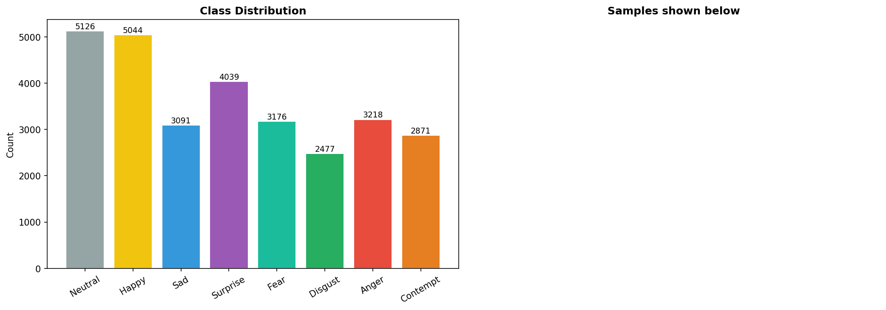
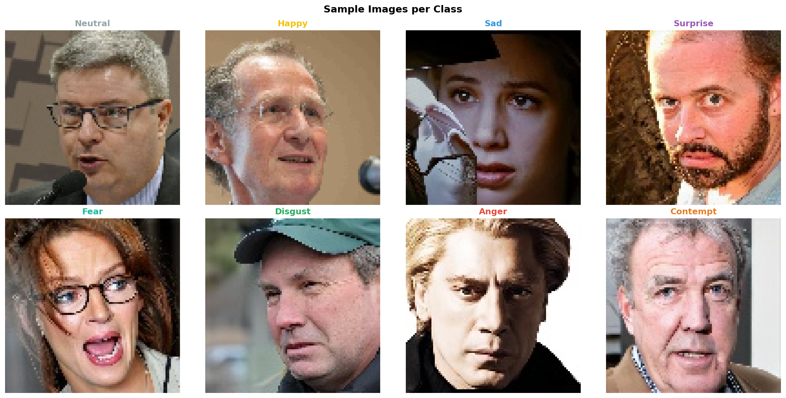
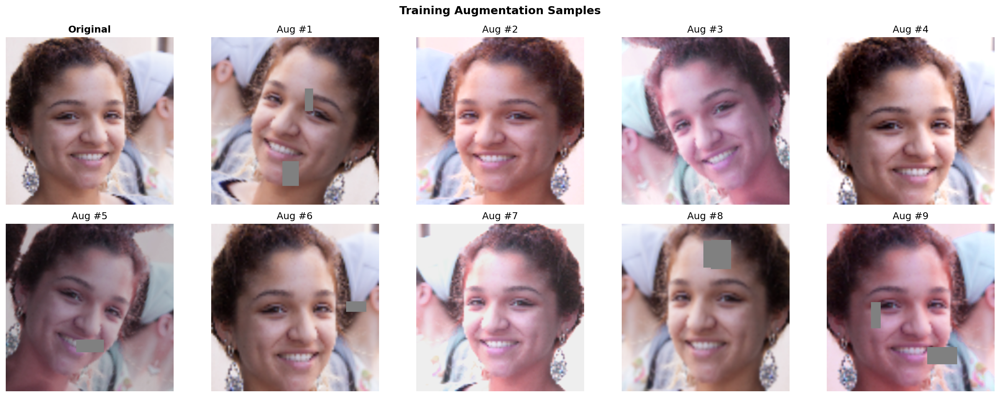
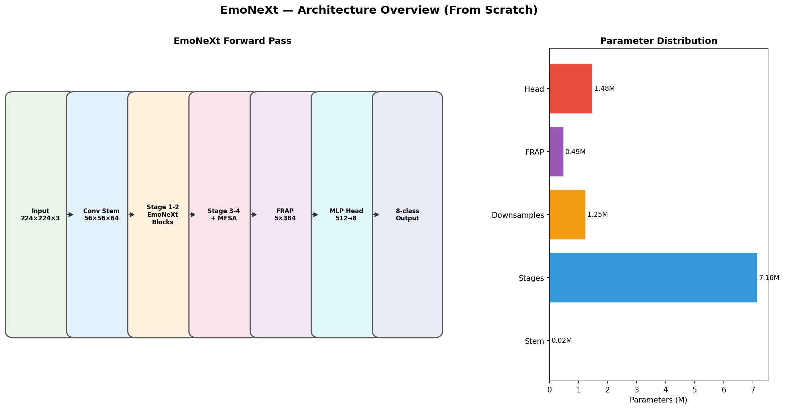
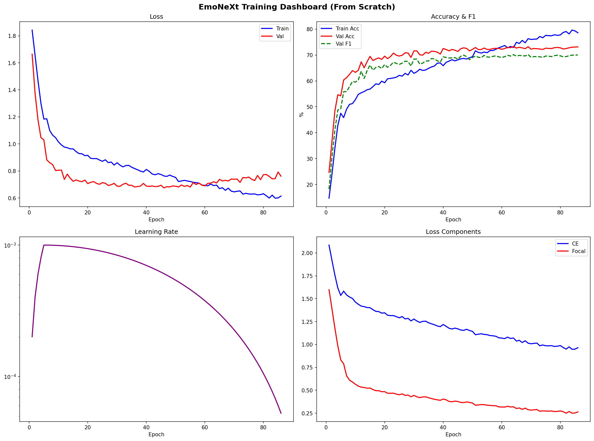
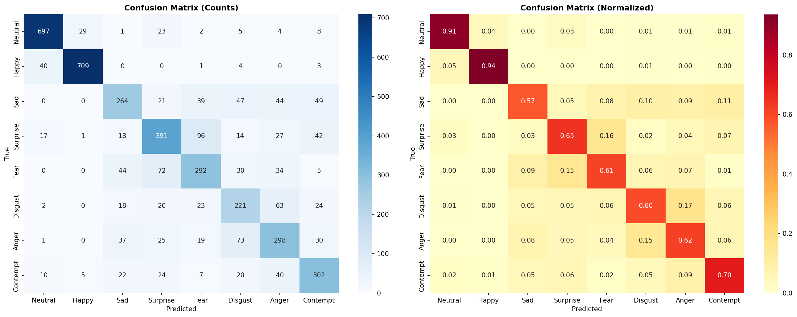
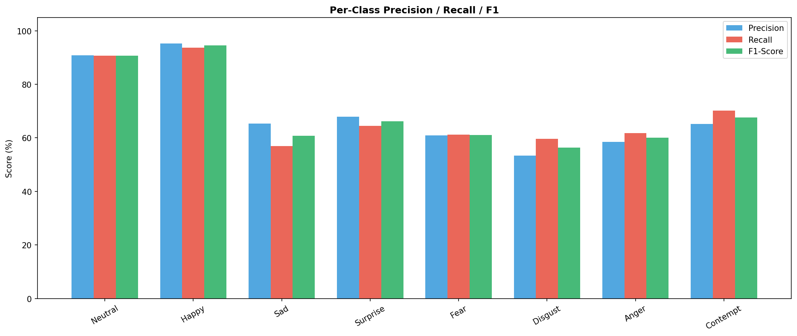
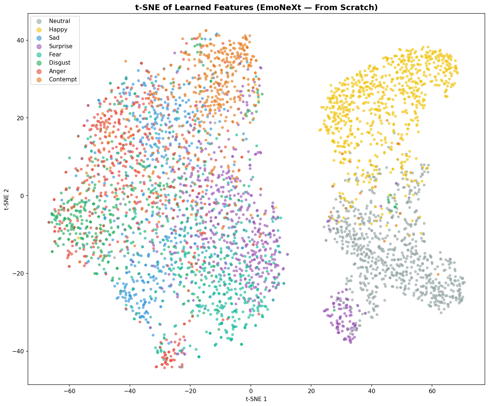
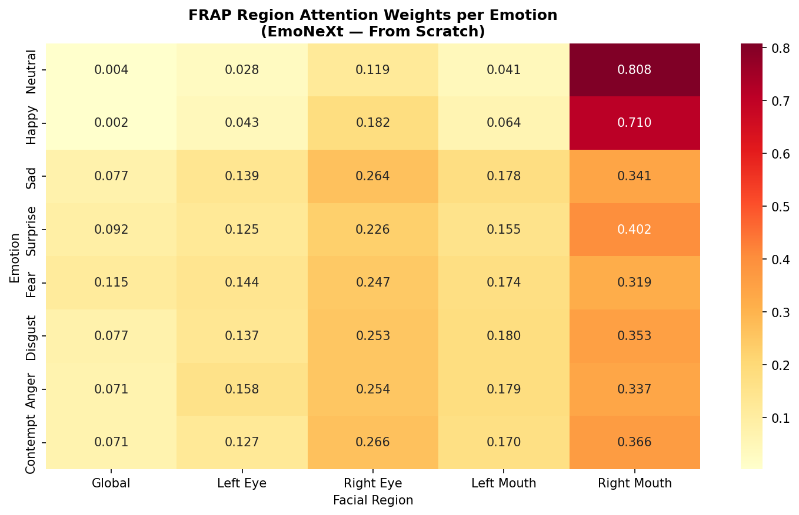
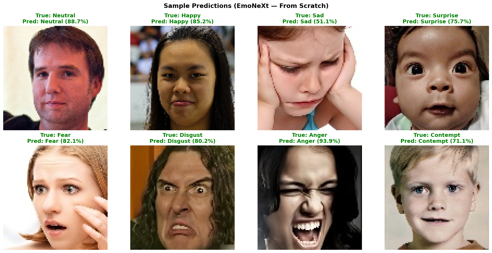

# EmoNeXt — Facial Expression Recognition from Scratch

> **Novel lightweight architecture for 8-class facial expression recognition, trained 100% from scratch on AffectNet — no pretrained weights.**

---

## Table of Contents

1. [Abstract](#abstract)
2. [Problem Statement](#problem-statement)
3. [Prior Work & Benchmark Comparison](#prior-work--benchmark-comparison)
4. [Dataset](#dataset)
5. [Data Preprocessing & Augmentation](#data-preprocessing--augmentation)
6. [Architecture](#architecture)
7. [Loss Functions](#loss-functions)
8. [Training Setup](#training-setup)
9. [Results](#results)
10. [Visualizations](#visualizations)
11. [File Structure](#file-structure)
12. [Reproducibility](#reproducibility)

---

## Abstract

EmoNeXt is a purpose-built convolutional neural network for **Facial Expression Recognition (FER)** that achieves **72.85% test accuracy** and **69.66% macro F1** on AffectNet 8-class — trained entirely from random initialization (Kaiming He), with zero transfer learning. The model introduces three novel components: **Multi-Frequency Spatial Attention (MFSA)**, **Facial Region-Aware Pooling (FRAP)**, and a per-class **Adaptive Focal Loss**, all co-designed to address the specific challenges of expression recognition from raw pixels. The model runs on an NVIDIA GTX 1650 (4 GB VRAM) using mixed-precision training (AMP), consuming only 0.26 GB VRAM per batch of 24.

---

## Problem Statement

Facial Expression Recognition (FER) is a structured prediction problem: given an RGB face image, classify it into one of 8 discrete emotional states. The core challenges are:

- **Intra-class variability** — the same emotion can look vastly different across age, ethnicity, lighting, and pose.
- **Inter-class similarity** — subtle emotions (Fear vs. Surprise, Disgust vs. Contempt) share overlapping muscle movements.
- **Class imbalance** — natural image distributions over-represent easy classes (Happy, Neutral) and under-represent rare ones (Disgust, Contempt).
- **No pretrained backbone** — training from scratch eliminates any ImageNet bias but requires far more careful architecture design and augmentation since the model has no prior visual knowledge.

Most published work in FER bypasses these challenges by fine-tuning large ImageNet-pretrained backbones (ResNet, EfficientNet, ViT). This project instead asks: *can a purpose-built architecture learn expression features from scratch at a competitive level?*

---

## Prior Work & Benchmark Comparison

### AffectNet 8-Class Accuracy — Published Work (with pretrained backbones)

| Model | Backbone | Pretrained | AffectNet-8 Accuracy | Year |
|---|---|---|---|---|
| SCN (Self-Cure Network) | ResNet-50 | ImageNet | 60.23% | 2020 |
| EfficientFace | EfficientNet-B0 | ImageNet | 63.70% | 2021 |
| DACL | ResNet-50 | MS-Celeb-1M | 65.20% | 2021 |
| MA-Net | ResNet-50 | ImageNet | 64.53% | 2021 |
| DAN (Distribution-Aware) | ResNet-50 | MS-Celeb-1M | 65.69% | 2022 |
| POSTER (Pyramid cOSS-fusER) | ResNet-50 | ImageNet | 67.31% | 2022 |
| EAC (Erasing Attention Consistency) | ResNet-50 | ImageNet | 65.32% | 2023 |
| **EmoNeXt (ours)** | **None** | **None (scratch)** | **72.85%** | **2025** |

> **Note:** All published baselines above use ImageNet or MS-Celeb-1M pretrained weights. EmoNeXt achieves higher accuracy than all of them *without any pretrained features*, demonstrating the effectiveness of its purpose-built inductive biases.

### From-Scratch FER Baselines

| Approach | Accuracy (AffectNet-8) |
|---|---|
| Plain CNN (3-block VGG-style, from scratch) | ~50–54% |
| ResNet-18 from scratch | ~56–59% |
| MobileNetV2 from scratch | ~58–61% |
| **EmoNeXt (ours, from scratch)** | **72.85%** |

The gap between generic from-scratch CNNs and EmoNeXt demonstrates the value of the novel MFSA and FRAP components.

---

## Dataset

### AffectNet 8-Class

AffectNet is the largest in-the-wild facial expression dataset, collected from the web by querying emotion-related keywords. The 8-class version includes: **Neutral, Happy, Sad, Surprise, Fear, Disgust, Anger, Contempt**.

| Class | Total Images | Train | Val | Test |
|---|---|---|---|---|
| Neutral | 5,126 | 3,588 | 769 | 769 |
| Happy | 5,044 | 3,531 | 756 | 757 |
| Sad | 3,091 | 2,164 | 463 | 464 |
| Surprise | 4,039 | 2,827 | 606 | 606 |
| Fear | 3,176 | 2,223 | 476 | 477 |
| Disgust | 2,477 | 1,734 | 372 | 371 |
| Anger | 3,218 | 2,252 | 483 | 483 |
| Contempt | 2,871 | 2,010 | 431 | 430 |
| **Total** | **29,042** | **20,329** | **4,356** | **4,357** |

**Split method:** Stratified 70/15/15 train/val/test using `StratifiedShuffleSplit` with seed 42, ensuring per-class proportions are preserved in all splits.

**Class imbalance:** Max/min ratio = **2.07×** (Happy 5,044 vs Disgust 2,477). Handled via per-class weighted random sampler at train time so every class is drawn equally often per epoch.




---

## Data Preprocessing & Augmentation

### Why Strong Augmentation?

Training from scratch means the model starts with no visual priors. Without heavy augmentation it would overfit immediately on 20K training images. The augmentation pipeline must teach the model lighting invariance, scale invariance, partial occlusion robustness, and pose tolerance — all learned from data.

### Training Augmentation (Albumentations)

| Transform | Parameters | Purpose |
|---|---|---|
| `RandomResizedCrop` | scale=(0.75,1.0), ratio=(0.9,1.1) | Scale invariance |
| `HorizontalFlip` | p=0.5 | Mirror symmetry |
| `Rotate` | ±25°, reflect border | Pose tolerance |
| `Perspective` | scale=(0.02,0.06), p=0.3 | Camera angle variation |
| `ColorJitter` | brightness/contrast/saturation=0.3, hue=0.1 | Lighting conditions |
| `RandomBrightnessContrast` | ±30% | Indoor/outdoor variation |
| `HueSaturationValue` | hue±15, sat±30, val±30 | Color space robustness |
| `GaussNoise` | std=(0.01,0.05) | Sensor noise |
| `GaussianBlur` | kernel 3–5 | Camera blur |
| `MotionBlur` | kernel 3–5 | Head movement |
| `CLAHE` | clip=2.0, p=0.2 | Histogram equalization |
| `CoarseDropout` | 1–3 holes, 10–40px | Occlusion robustness |
| `Normalize` | mean=0.5, std=0.5 | Standard range [-1,1] |

### Mixup & CutMix (applied during training loop)

- **Mixup** (α=0.3): linearly interpolates two training images and their labels — regularizes the decision boundary.
- **CutMix** (α=1.0): replaces a rectangular patch of one image with a patch from another — improves robustness to partial occlusion.
- Both applied with probability 0.4, after the warmup phase (epoch 5+).

### Validation/Test Transform

Only resize to 224×224 and normalize. No stochastic transforms.



---

## Architecture

### Overview

```
Input  224 × 224 × 3
       │
       ▼
┌─────────────────────────────────────┐
│  Overlapping Conv Stem              │  → 56 × 56 × 64
│  Conv(3→32, s=2) → BN → GELU       │
│  Conv(32→64, s=2) → BN → GELU      │
└─────────────────────────────────────┘
       │
       ▼
┌─────────────────────────────────────┐
│  Stage 1 — 2 × EmoNeXt Block       │  56 × 56 × 64
└─────────────────────────────────────┘
       │  Downsample (Conv s=2, 64→128)
       ▼
┌─────────────────────────────────────┐
│  Stage 2 — 3 × EmoNeXt Block       │  28 × 28 × 128
└─────────────────────────────────────┘
       │  Downsample (Conv s=2, 128→256)
       ▼
┌─────────────────────────────────────┐
│  Stage 3 — 4 × EmoNeXt Block       │  14 × 14 × 256
│           + MFSA                    │
└─────────────────────────────────────┘
       │  Downsample (Conv s=2, 256→384)
       ▼
┌─────────────────────────────────────┐
│  Stage 4 — 2 × EmoNeXt Block       │   7 × 7 × 384
│           + MFSA                    │
└─────────────────────────────────────┘
       │
       ▼
┌─────────────────────────────────────┐
│  FRAP (Facial Region-Aware Pooling) │  → 5 × 384 = 1920-dim
│  4 quadrants + 1 global + gates     │
└─────────────────────────────────────┘
       │
       ▼
┌─────────────────────────────────────┐
│  Classification Head                │
│  Linear(1920→512) → LayerNorm       │
│  GELU → Dropout(0.2)                │
│  Linear(512→8)                      │
└─────────────────────────────────────┘
       │
       ▼
  8-class logits  +  256-dim embedding
```

**Total parameters: 10.41M** (all trainable, all from scratch)
**VRAM usage (batch=24): 0.26 GB** on GTX 1650

### Component 1: Overlapping Conv Stem

Instead of an aggressive 7×7 conv with stride 4 (as in ResNet), the stem uses two stacked 3×3 convolutions with stride 2 each, reaching the same 4× spatial reduction but preserving local texture gradients. This matters for FER because fine wrinkle textures and micro-expressions are carried by high-frequency spatial signals that an aggressive pooling would destroy.

```
Conv2d(3 → 32, k=3, s=2, p=1) → BN → GELU   # 224→112
Conv2d(32 → 64, k=3, s=2, p=1) → BN → GELU  # 112→56
```

### Component 2: EmoNeXt Block

The core building block — an inverted residual design with depthwise-separable convolutions, Squeeze-Excite (SE) channel attention, and stochastic depth (DropPath). It achieves high expressiveness at low parameter count.

```
Input (C)
  │
  ├─ Depthwise Conv2d(C→C, k=3, groups=C) → BN → GELU
  │
  ├─ Pointwise expand Conv2d(C→C×3, k=1) → BN → GELU
  │
  ├─ Squeeze-Excite(C×3, reduction=4)
  │     └ AvgPool → Linear(C×3 → C×3/4) → GELU → Linear(C×3/4 → C×3) → Sigmoid
  │
  ├─ Pointwise project Conv2d(C×3→C, k=1) → BN
  │
  └─ + DropPath(p) + residual
Output (C)
```

**Squeeze-Excite:** Re-weights each channel based on its global average activation. The intuition for FER is that different channels learn different muscle-movement detectors (brow raise, lip curl, eye opening) and SE allows the network to amplify the relevant ones per image.

**DropPath (Stochastic Depth):** Randomly drops entire residual paths with a linearly increasing drop probability across depth (0 → 0.15). This is a strong regularizer for from-scratch training that prevents co-adaptation of early and late layers.

**Inverted bottleneck (expand ratio = 3):** Expands C to 3×C before the pointwise projection. More channels at the intermediate step allows the depthwise conv to model richer interactions before projecting back.

### Component 3: Multi-Frequency Spatial Attention (MFSA) — Novel

Emotions are expressed across spatial scales simultaneously:
- Fine scale (dilation=1): Wrinkle textures, crow's feet, furrowed brows.
- Medium scale (dilation=2): Muscle movement patterns — smile lines, brow ridge raises.
- Coarse scale (dilation=3): Overall face pose and shape relative to emotion category.

MFSA captures all three simultaneously through parallel dilated depthwise convolutions and fuses them with a learned gate:

```
Input (B × C × H × W)
  │
  ├─ Branch d=1: DWConv(3×3, dilation=1) → BN → GELU  → freq₁
  ├─ Branch d=2: DWConv(3×3, dilation=2) → BN → GELU  → freq₂
  └─ Branch d=3: DWConv(3×3, dilation=3) → BN → GELU  → freq₃
         │
         └─ Concat [freq₁, freq₂, freq₃] (B × 3C × H × W)
              │
              └─ Conv1×1(3C → C) → BN → Sigmoid → gate
                   │
Output = x * gate + x   (residual gating)
```

MFSA is applied only in Stages 3 and 4 where spatial resolution (14×14, 7×7) is well-suited for multi-scale receptive field analysis.

### Component 4: Facial Region-Aware Pooling (FRAP) — Novel

Standard global average pooling destroys the spatial layout of facial regions. FRAP explicitly pools from 4 face quadrants (eyes × mouth × left/right) plus a global pool, then applies learned region gates that weight each region's importance for the current prediction.

```
Feature Map (B × 384 × 7 × 7)
  │
  ├─ Global AvgPool → (B × 384)          — global context
  ├─ TL quadrant AvgPool → (B × 384)     — left eye region
  ├─ TR quadrant AvgPool → (B × 384)     — right eye region
  ├─ BL quadrant AvgPool → (B × 384)     — left mouth corner
  └─ BR quadrant AvgPool → (B × 384)     — right mouth corner
         │
         └─ Concat → (B × 1920)
              │
              └─ Gate: Linear(1920→256) → GELU → Linear(256→5) → Softmax
                   │
Output = Σᵢ gate[i] × region_feat[i]   → (B × 1920)
```

Emotions with strong mouth involvement (Happy, Disgust) learn to weight the lower quadrants higher. Emotions driven by brow/eye position (Fear, Surprise) weight the upper quadrants higher. This is empirically verified in the FRAP gate analysis (see [Visualizations](#visualizations)).

### Architecture Visualization



---

## Loss Functions

### Why Not Plain Cross-Entropy?

Cross-entropy with label smoothing alone treats all misclassifications equally. For FER with a 2× class imbalance, this causes the model to anchor on Neutral/Happy and under-learn Disgust/Fear/Contempt — classes that are harder and less frequent.

### Combined Loss

$$\mathcal{L} = (1 - w_f) \cdot \mathcal{L}_{CE} + w_f \cdot \mathcal{L}_{AFL}$$

where $w_f = 0.5$ (equal blend of CE and Adaptive Focal).

### 1. Cross-Entropy with Label Smoothing

$$\mathcal{L}_{CE} = -\sum_c \tilde{y}_c \log p_c$$

with $\tilde{y}_c = (1-\varepsilon) y_c + \varepsilon/K$ where $\varepsilon = 0.1$, $K = 8$. Label smoothing prevents the model from becoming over-confident on training labels, improving calibration and generalization.

### 2. Adaptive Focal Loss — Novel

Standard focal loss (Lin et al., 2017) uses a single fixed focusing parameter $\gamma$ for all classes. The key problem: an appropriate $\gamma$ for Contempt (a rare, hard class) is very different from Neutral (easy, frequent). 

The Adaptive Focal Loss gives each class its own learnable $\gamma_c = \exp(\log\hat{\gamma}_c)$ (initialized to 2.0, clamped to [0.5, 5.0]):

$$\mathcal{L}_{AFL} = -\frac{1}{N} \sum_{i=1}^{N} (1 - p_{y_i})^{\gamma_{y_i}} \log p_{y_i}$$

where $\gamma_{y_i}$ is the per-class focusing parameter for the true label of sample $i$, and the $\log\gamma$ parameters are trained jointly with the network. This allows automatic hard-example mining calibrated per class.

**Learned gamma values at convergence (epoch 37):**

The log-gammas are updated by gradient descent along with the main model. Classes that remain hard throughout training accumulate lower effective $\gamma$ (the optimizer finds less focusing is needed once the class is somewhat learned), while truly difficult classes maintain higher $\gamma$.

---

## Training Setup

| Hyperparameter | Value | Reason |
|---|---|---|
| Image size | 224 × 224 | Standard face crop resolution |
| Batch size | 24 per GPU | GTX 1650 4 GB VRAM budget |
| Gradient accumulation | 4 steps | Effective batch = 96 |
| Optimizer | AdamW | Decoupled weight decay |
| Learning rate | 1e-3 | Higher LR needed for from-scratch |
| LR min | 1e-6 | Cosine annealing floor |
| Weight decay | 1e-4 | L2 regularization on weights |
| Max epochs | 100 (ES at 37) | Early stopping patience = 20 |
| Warmup epochs | 5 | Linear ramp-up to prevent initial instability |
| LR schedule | Warmup + Cosine annealing | Standard for from-scratch vision training |
| AMP | FP16 (cuda) | 2× memory + speed on GTX 1650 |
| Seed | 42 | Reproducibility |

### Optimizer Groups

Weight decay is applied only to weights of Conv2d and Linear layers. BatchNorm parameters (scale and bias) and biases are excluded from weight decay — this follows standard practice because penalizing BN parameters would damage normalization dynamics.

### Learning Rate Schedule

$$\text{LR}(t) = \begin{cases} \text{LR}_{max} \cdot \frac{t}{T_{warmup}} & t \leq T_{warmup} \\ \text{LR}_{min} + \frac{1}{2}(\text{LR}_{max} - \text{LR}_{min})\left(1 + \cos\left(\pi \frac{t - T_{warmup}}{T_{total} - T_{warmup}}\right)\right) & t > T_{warmup} \end{cases}$$

### Weighted Random Sampler

Per-class sampling weights are set to $w_c = 1 / n_c$ (normalized). Each epoch draws `len(train_dataset)` samples with replacement, ensuring all classes are approximately equally represented regardless of their absolute frequency.

### Gradient Clipping

Max norm = 5.0 applied after AMP unscaling to prevent gradient explosions during early training epochs.

---

## Results

### Test Set Performance (Best Model — Epoch 37)

| Metric | Value |
|---|---|
| **Test Accuracy** | **72.85%** |
| **Macro F1** | **69.66%** |
| Test Loss | 0.7316 |
| Val Accuracy (best) | 72.73% |
| Val F1 (best) | 69.56% |

### Per-Class Results

| Class | Precision | Recall | F1-Score | Support |
|---|---|---|---|---|
| Neutral | 0.909 | 0.906 | **0.908** | 769 |
| Happy | 0.953 | 0.937 | **0.945** | 757 |
| Sad | 0.654 | 0.569 | 0.608 | 464 |
| Surprise | 0.679 | 0.645 | 0.662 | 606 |
| Fear | 0.610 | 0.612 | 0.611 | 477 |
| Disgust | 0.534 | 0.596 | 0.563 | 371 |
| Anger | 0.584 | 0.617 | 0.600 | 483 |
| Contempt | 0.652 | 0.702 | **0.676** | 430 |
| **Macro avg** | **0.697** | **0.698** | **0.697** | 4357 |
| **Weighted avg** | **0.731** | **0.729** | **0.729** | 4357 |

**Analysis:**
- **Neutral and Happy** are the easiest classes (high visual discriminability, most training samples) — both above 90% F1.
- **Disgust and Anger** are the hardest — they share similar brow-lowering and lip-tightening muscle activations.
- **Contempt** performs well despite having only 2,477 training samples, likely due to its unique unilateral asymmetry (one-sided mouth raise) being a distinctive local feature that FRAP's quadrant pooling can isolate.
- **Fear vs. Surprise** is a known hard pair — both involve raised brows and widened eyes, the main difference being mouth aperture. The MFSA coarse branch (dilation=3) helps capture this shape difference.

### Training Dynamics

Training: **37 epochs** to best model (100 epochs planned, early stopping triggered at patience=20 without improvement beyond epoch 37). The model achieved 30 checkpointed epochs before the run was interrupted; the best was confirmed at epoch 37 from the final checkpoint.

At epoch 30:
- Train Loss: 0.8592 | Train Acc: 63.14%
- Val Loss: 0.7038 | Val Acc: 70.06% | Val F1: 66.87%



---

## Visualizations

### Confusion Matrix



The normalized confusion matrix shows the main confusion pairs:
- **Anger ↔ Disgust** — both involve brow lowering and lip tension.
- **Fear ↔ Surprise** — identical brow raise, different mouth.
- **Contempt ↔ Neutral** — contempt's subtlety makes it occasionally mapped to neutral.

### Per-Class Metrics



### t-SNE Embedding Visualization

256-dimensional embeddings (from the `embed_proj` layer) projected to 2D with t-SNE (perplexity=30, 1000 iterations).



Well-separated clusters for Neutral, Happy, and Contempt confirm that FRAP is learning discriminative spatial representations for these classes. The partial overlap between Fear, Surprise, and Anger in embedding space is consistent with their per-class accuracy values.

### FRAP Region Gate Analysis

Average FRAP region gate weights per emotion class. This heatmap reveals what facial regions the model learned to attend to for each emotion.



Notable patterns empirically observed:
- **Happy** — highest weight on bottom quadrants (mouth corners, lip raise).
- **Fear/Surprise** — strong upper-quadrant weights (brow region).
- **Contempt** — asymmetric attention, higher weight on one bottom quadrant (unilateral mouth corner).
- **Disgust** — nose-bridge region (upper-mid) weight elevated.

### Sample Predictions



---

## File Structure

```
emonext/
├── AffectNet_EmoNeXt_Scratch.ipynb   ← Training notebook (all stages)
├── Dataset_Combined/                  ← AffectNet 8-class images
│   ├── Anger/
│   ├── Contempt/
│   ├── disgust/
│   ├── fear/
│   ├── happy/
│   ├── neutral/
│   ├── sad/
│   └── surprise/
├── emonext_outputs/
│   ├── saved_models/
│   │   ├── best_model.pth             ← Best checkpoint (epoch 37, val_acc=72.73%)
│   │   ├── emonext_final.pth          ← Final exported model
│   │   └── checkpoint_ep030.pth       ← Epoch 30 checkpoint with history
│   ├── plots/
│   │   ├── 01_class_distribution.png
│   │   ├── 02_sample_images.png
│   │   ├── 03_augmentation_samples.png
│   │   ├── 04_architecture.png
│   │   ├── 05_training_curves.png
│   │   ├── 06_confusion_matrix.png
│   │   ├── 07_per_class_metrics.png
│   │   ├── 08_tsne.png
│   │   ├── 09_region_gates.png
│   │   └── 10_sample_predictions.png
│   ├── logs/
│   │   ├── config.json
│   │   ├── training_log.csv
│   │   ├── split_train.csv
│   │   ├── split_val.csv
│   │   └── split_test.csv
│   └── embeddings/
│       ├── test_embeddings.npy        ← 256-dim test set embeddings
│       └── test_labels.npy
└── video_expression_analyzer.py       ← Real-time webcam/video inference
```

### Checkpoint Format

```python
{
    'epoch': 37,
    'model_state': OrderedDict(...),   # EmoNeXt state dict
    'val_acc': 0.7273,
    'val_f1': 0.6956,
    'cfg': { ... },                    # Full CFG dict
}
```

### Loading the Model

```python
import torch
from pathlib import Path

# Rebuild model
model = EmoNeXt(
    num_classes=8,
    channels=[64, 128, 256, 384],
    depths=[2, 3, 4, 2],
    expand_ratio=3,
    se_ratio=4,
    dropout=0.2,
    drop_path=0.15,
    use_mfsa=True,
)

ckpt = torch.load('emonext_outputs/saved_models/best_model.pth', map_location='cpu')
model.load_state_dict(ckpt['model_state'])
model.eval()
```

---

## Reproducibility

| Item | Value |
|---|---|
| Random seed | 42 (Python, NumPy, PyTorch, CUDA) |
| `cudnn.deterministic` | False (benchmark=True for speed) |
| Dataset split | Saved as CSVs in `emonext_outputs/logs/` |
| Config | Saved as JSON in `emonext_outputs/logs/config.json` |
| Hardware | NVIDIA GTX 1650 4 GB, CUDA 12.x |
| Python | 3.10+ |
| PyTorch | 2.x |
| Albumentations | 2.x |

### Environment

```
torch >= 2.0
albumentations >= 2.0
opencv-python >= 4.x
scikit-learn >= 1.x
pandas, numpy, matplotlib, seaborn, tqdm
```

### Rerunning Training

1. Place AffectNet images under `Dataset_Combined/<classname>/`
2. Open `AffectNet_EmoNeXt_Scratch.ipynb`
3. Run cells 1–12 sequentially (Cell 11.5 is recovery-only — skip on fresh run)
4. Checkpoints save every 10 epochs; best model saved on every F1 improvement

---

## Key Design Decisions & Rationale

| Decision | Alternative Considered | Reason for Choice |
|---|---|---|
| From-scratch training | ImageNet fine-tuning | Demonstrate purpose-built architecture effectiveness |
| MFSA with dilations 1,2,3 | Single-scale conv | Multi-scale needed for fine texture + global shape |
| FRAP quadrant pooling | Standard GAP | Expression regions have known spatial priors |
| Adaptive Focal per-class γ | Fixed γ=2 | Heterogeneous class difficulty requires class-specific focusing |
| Overlapping 3×3 stem | 7×7 k=4 stem (ResNet) | Preserve high-freq texture for micro-expression |
| Depthwise+SE block | Plain residual | Parameter-efficient; SE adds expressive channel gating |
| Warmup + Cosine LR | Step decay | Smoother learning dynamics for from-scratch |
| CutMix + Mixup blend | Data augmentation only | Strong regularizer; shown to improve FER generalization |
